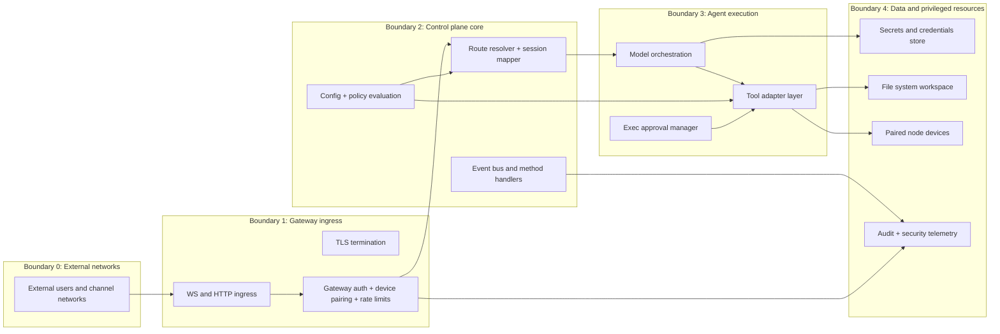
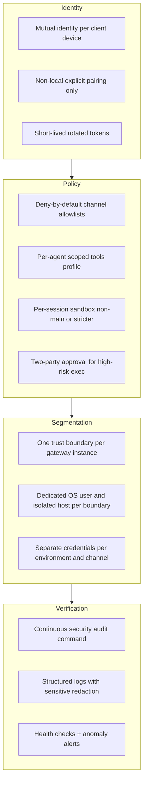
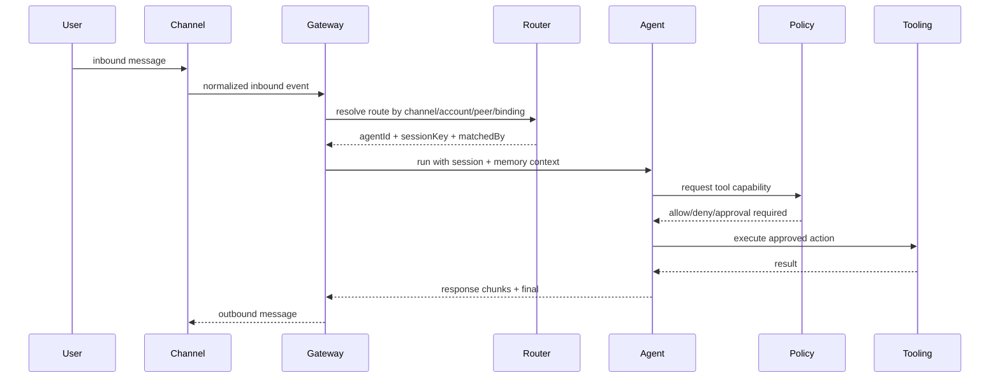

# Enterprise zero-trust architecture

## 1) Full system map (logical)

```mermaid
flowchart TB
  subgraph U[Users and operators]
    WA[WhatsApp users]
    TG[Telegram users]
    SL[Slack users]
    DC[Discord users]
    SG[Signal users]
    IM[iMessage users]
    WEB[WebChat users]
    OP[Operators: CLI, macOS app, web UI]
  end

  subgraph C[Channel adapters + plugin channels]
    CHCORE[Core channels: WhatsApp Telegram Slack Discord Signal iMessage IRC Google Chat]
    CHEXT[Extension channels: Teams Matrix Zalo ZaloUser BlueBubbles etc]
  end

  subgraph G[Gateway control plane (single WS/HTTP runtime)]
    WS[WebSocket API: req res event]
    HTTP[HTTP surfaces: Control UI chat endpoints hooks canvas host]
    AUTH[Auth pairing device trust token checks]
    ROUTE[Routing + session key resolution + bindings]
    METHODS[Gateway methods + events catalog]
    HEALTH[Presence health heartbeat cron telemetry]
  end

  subgraph A[Agent runtime]
    MODEL[LLM model provider calls]
    TOOLS[Tools exec browser filesystem network node invoke]
    POLICY[Tool policy + approvals + allow/deny profiles]
    MEMORY[Session history and memory]
  end

  subgraph X[Execution isolation]
    HOST[Host execution]
    SANDBOX[Per-session sandbox Docker mode]
    NODE[Paired nodes macOS iOS Android headless]
  end

  subgraph S[State and secrets]
    CFG[openclaw.json runtime config]
    CREDS[credentials and channel auth material]
    SESS[session storage + previews]
    LOGS[logs and audit streams]
  end

  WA --> CHCORE
  TG --> CHCORE
  SL --> CHCORE
  DC --> CHCORE
  SG --> CHCORE
  IM --> CHCORE
  WEB --> HTTP
  OP --> WS
  OP --> HTTP

  CHCORE --> ROUTE
  CHEXT --> ROUTE
  ROUTE --> A
  WS --> METHODS
  HTTP --> METHODS
  AUTH --> WS
  AUTH --> HTTP
  METHODS --> A
  HEALTH --> OP

  A --> MODEL
  A --> TOOLS
  TOOLS --> POLICY
  POLICY --> HOST
  POLICY --> SANDBOX
  TOOLS --> NODE
  A --> MEMORY

  G <--> S
  A <--> S
```

## 2) Runtime trust boundaries (recommended enterprise layering)



## 3) Practical zero-trust target state for enterprise hardening



## 4) Channel to agent routing model (how inbound turns become execution)



## 5) Enterprise implementation notes

- Keep one gateway per trust boundary and avoid adversarial multi-tenant sharing of one runtime.
- Place gateway ingress behind private network controls and require explicit authentication/pairing.
- Use minimal tool profiles plus sandbox defaults for non-main sessions, then elevate only by explicit approval flow.
- Maintain separate channel credentials, model keys, and operator identities per environment (dev/stage/prod, team-by-team).
- Treat node invocation (camera/screen/location/canvas) as privileged remote execution and gate it like production infrastructure access.
